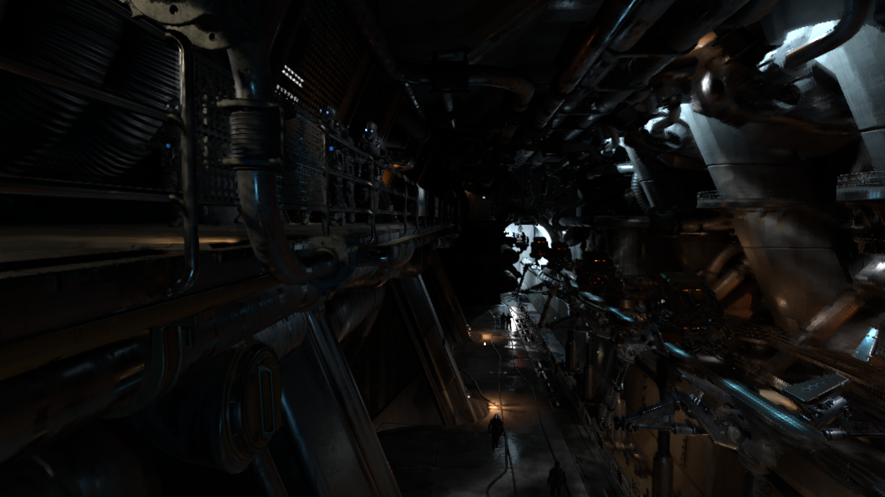

# Off-Screen FidelityFX Super Resolution 2.1 (FSR 2.1.2)

Copyright (c) 2022 Advanced Micro Devices, Inc. All rights reserved.

AMD FidelityFX Super Resolution 2 (FSR 2) is an open source, high-quality solution for producing high resolution frames from lower resolution inputs.For more details about [this](https://github.com/GPUOpen-Effects/FidelityFX-FSR2).



# Off-Screen FSR2

Are you tired of all these api stuffs you need to successfully use FSR2 ?
As for this off-screen version,all you need is to feed a few color textures ,motion vector and depth textures,it will work.

It's useful when you captured some textures from other rendering engine.

# Building the sample

## Prerequisites

To build the off-screen FSR2 , please follow the following instructions:

1) Install the following tools:

- [Vulkan above 1.3](https://www.vulkan.org/tools#download-these-essential-development-tools)
- [CMake 3.16](https://cmake.org/download/)
- Install the "Desktop Development with C++" workload
- [Visual Studio 2019](https://visualstudio.microsoft.com/downloads/)
- [Windows 10 SDK 10.0.18362.0](https://developer.microsoft.com/en-us/windows/downloads/windows-10-sdk)
- [Git 2.32.0](https://git-scm.com/downloads)

2) Generate the solutions:
    ```
    > cd <installation path>\build
    > GenerateSolutions.bat
    ```

3) Open the solutions in Vulkan directory,choose the target named ```FSR2_OffScreen_VK``` ,compile and run.

4) The off-screen version which currently runs on Vulkan,to use this,you need to provide:
- Color textures (RGBA)
- Motion vectors and depth textures(RG for motion vectors and B for depth,and please remain the A channel)

# Limitations

FSR 2 requires a GPU with typed UAV load support.

# Version history

| Version        | Date              | Notes                                                        | 
| ---------------|-------------------|--------------------------------------------------------------|
| **2.1.0**      | 2022-09-06        | Release of FidelityFX Super Resolution 2.1.                  |
| **2.0.1**      | 2022-06-22        | Initial release of FidelityFX Super Resolution 2.0.          |


# References
[**Akeley-06**] Kurt Akeley and Jonathan Su, **"Minimum Triangle Separation for Correct Z-Buffer Occlusion"**, 
[http://www.cs.cmu.edu/afs/cs/academic/class/15869-f11/www/readings/akeley06_triseparation.pdf](https://www.cs.cmu.edu/afs/cs/academic/class/15869-f11/www/readings/akeley06_triseparation.pdf)

[**Lanczos**] Lanczos resampling, **"Lanczos resampling"**, [https://en.wikipedia.org/wiki/Lanczos_resampling](https://en.wikipedia.org/wiki/Lanczos_resampling)

[**Halton**] Halton sequence, **"Halton sequence"**, [https://en.wikipedia.org/wiki/Halton_sequence](https://en.wikipedia.org/wiki/Halton_sequence)

[**YCoCg**] YCoCg Color Space, [https://en.wikipedia.org/wiki/YCoCg](https://en.wikipedia.org/wiki/YCoCg)
